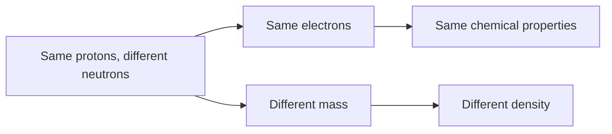

# 1.2 Isotopes

> [!abstract] In one breath
> Isotopes are atoms of the same element that differ only in their number of neutrons. Because the electrons are identical the chemistry is identical, but the extra mass changes physical properties such as density.

## Key ideas

**Isotopes** are atoms of the same element (same number of protons, i.e. the same proton number) with different numbers of neutrons, and so different nucleon numbers. Both halves of that sentence earn the marks.

**Nuclide notation:** in $^{x}_{y}\mathrm{A}$, $x$ is the nucleon (mass) number, protons plus neutrons, and $y$ is the proton (atomic) number.

$$\text{neutrons}=x-y \qquad \text{electrons}=y-q \ \text{(for an ion of charge } q+\text{)}$$

A neutral atom has equal protons and electrons. The charge changes only the electrons, never the protons or neutrons.

**Same chemical properties:** chemical reactions involve the electrons, especially the outer ones. Isotopes have the same number of protons and so the same number of electrons and the same electron configuration. Neutrons have no charge and do not take part.

**Different physical properties:** isotopes have different numbers of neutrons, so their atoms have different masses. Properties that depend on mass, such as the density of a sample of the substance, differ.

## Method

1. Read the symbol: top number $x$ is the nucleon number, bottom number $y$ is the proton number.
2. Protons $=y$. Neutrons $=x-y$.
3. Electrons: start from $y$, then subtract $q$ for a positive ion or add $q$ for a negative ion.
4. Nuclear equations: balance the top numbers, then separately balance the bottom numbers, to find the missing particle.
5. Explanations: name the particle (electrons or neutrons), then say what it controls (chemistry or mass).

> [!example]- Worked example
> Particle X is formed in $^{27}_{13}\mathrm{Al}+{}^{4}_{2}\mathrm{He}\to{}^{30}_{15}\mathrm{P}+\mathrm{X}$. Identify X.
>
> 1. Top numbers: $27+4=31$ and $31=30+x$, so $x=1$.
>    *(Nucleon numbers must balance on their own.)*
> 2. Bottom numbers: $13+2=15$ and $15=15+y$, so $y=0$.
>    *(The proton numbers must balance separately.)*
> 3. Nucleon number 1 with no charge is a neutron, $^{1}_{0}\mathrm{n}$.
>    *(An electron has nucleon number 0 and a proton has proton number 1.)*

## Traps

- **Trap:** atoms with the same mass number are isotopes. **Why it's wrong:** $^{40}\mathrm{Ar}$, $^{40}\mathrm{K}$ and $^{40}\mathrm{Ca}$ have different proton numbers, so they are different elements. **Instead:** check the proton number first.
- **Trap:** isotopes differ in protons or electrons. **Why it's wrong:** the proton number defines the element and a neutral atom has as many electrons as protons. **Instead:** only the neutrons change.
- **Trap:** balancing only one of the two numbers in a nuclear equation. **Why it's wrong:** an electron or a proton can fix one row but breaks the other. **Instead:** balance both rows.
- **Trap:** extra neutrons make an isotope react differently. **Why it's wrong:** chemistry depends on the electron configuration, which does not change. **Instead:** say same electrons, same chemical properties.
- **Trap:** isotopes have identical physical properties. **Why it's wrong:** extra neutrons add mass. **Instead:** say different mass and different density.

## Exam technique

- *Define* needs the full definition: same number of protons and different number of neutrons. "Different mass number" alone is too vague.
- *Explain* needs a reason in terms of particles. Examiners see many candidates give a basic definition and then fail to link it to chemical and physical properties, so always finish the link: "same electrons, so same chemistry; different neutrons, so different mass".
- For density of a gas at r.t.p. use $\rho = M/V_m$ with $V_m = 24.0\ \mathrm{dm^3\,mol^{-1}}$, and double the atomic molar mass for a diatomic gas.
- Give proton, neutron and electron counts as whole numbers, and check the sign of the charge.

## Links

Builds on [[1.1 Particles in the atom and atomic radius]] · Leads to [[1.3 Electrons, energy levels and atomic orbitals]]
