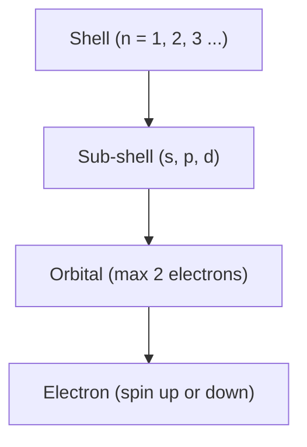

# 1.3 Electrons, energy levels and atomic orbitals

> [!abstract] In one breath
> Electrons sit in shells, which are split into sub-shells (s, p, d), which are made of orbitals holding at most two electrons each. They fill the lowest-energy orbitals first, and electrons in orbitals of equal energy spread out singly before they pair, because electrons repel each other.

## Key ideas

- **Shell:** a group of orbitals with the same principal quantum number $n$. Larger $n$ means further from the nucleus and higher energy.
- **Sub-shell:** a group of orbitals of the same type (s, p or d) within a shell.
- **Orbital:** a region of space around the nucleus that can hold a maximum of two electrons, with opposite spins.
- **Ground state:** all the electrons occupy the lowest available energy levels.

| Sub-shell | Orbitals | Max electrons | Shape |
|---|---|---|---|
| s | 1 | 2 | spherical |
| p | 3 | 6 | dumb-bell, along $x$, $y$, $z$ at $90^\circ$ |
| d | 5 | 10 | (not sketched at AS) |

A shell holds $2n^2$ electrons: 2, 8, 18 for $n=1,2,3$.

**Energy order:** $1s<2s<2p<3s<3p<4s<3d<4p$. The 4s sub-shell lies below 3d, so 4s fills first (K, Ca), then 3d (Sc onwards).

![[Assets/9701/9701-1.3-energy-order.svg]]

**Free radical:** a species with one or more unpaired electrons. Charge is irrelevant: $\ce{Cl}$, $\ce{O^-}$ and $\ce{Cl^+}$ are radicals, $\ce{Cl^-}$ is not.

## Method

1. **Count the electrons:** protons minus the charge (a $+$ ion has fewer electrons than protons).
2. **Fill in energy order** to each capacity (2, 2, 6, 2, 6, 2, 10, 6).
3. **For an ion,** write the atom first, then remove electrons from the outermost shell: 4s before 3d.
4. **Boxes:** one box per orbital. Put one arrow in every box of the sub-shell first, then pair up with opposite arrows.
5. **Count unpaired electrons** as the lone arrows.

> [!example]- Worked example
> Deduce the configuration of $\ce{Fe^{3+}}$ (proton number 26) and its number of unpaired electrons.
>
> 1. The atom has 26 electrons: $1s^2 2s^2 2p^6 3s^2 3p^6 3d^6 4s^2$, or $\ce{[Ar]}\,3d^6 4s^2$.
> 2. $\ce{Fe^{3+}}$ has $26-3=23$ electrons. Remove the two 4s electrons, then one 3d electron.
> 3. $$\ce{Fe^{3+}}:\ \ce{[Ar]}\,3d^5$$
> 4. Five 3d boxes each hold one arrow and the 4s box is empty, so there are **5 unpaired electrons**.

## Traps

- **Trap:** writing 3d before 4s in the filling order. **Why it's wrong:** 4s is lower in energy than 3d. **Instead:** fill 4s first, but *write* the configuration in shell order (3d before 4s).
- **Trap:** removing 3d electrons first when forming $\ce{Fe^{2+}}$. **Why it's wrong:** the outermost (4s) electrons leave first. **Instead:** $\ce{Fe^{2+}}$ is $\ce{[Ar]}\,3d^6$, not $3d^4 4s^2$.
- **Trap:** pairing electrons in a p sub-shell too early, so P and S get 1 and 0 unpaired electrons. **Why it's wrong:** electrons occupy separate equal-energy orbitals singly first. **Instead:** P $3p^3$ has 3 and S $3p^4$ has 2 (examiners saw 1, 0 and 1 for P, S and Cl).
- **Trap:** saying a p orbital holds six electrons. **Instead:** an orbital holds 2; the p *sub-shell* (three orbitals) holds 6.
- **Trap:** calling the outer electrons the "lowest energy" orbital. **Instead:** the lowest-energy orbital is 1s, closest to the nucleus.
- **Trap:** thinking ions cannot be radicals. **Instead:** look for unpaired electrons only.

## Exam technique

- **Give** or **State:** write the configuration cleanly, either full or shorthand $\ce{[Ar]}\,3d^6 4s^2$.
- **Explain:** for repulsion questions, name *inter-electron repulsion* and say which arrangement has less of it, for example one electron per orbital. In ionisation-energy questions on sulfur, credit goes to the pair in one 3p orbital.
- **Cr and Cu:** chromium is $\ce{[Ar]}\,3d^5 4s^1$ and copper is $\ce{[Ar]}\,3d^{10} 4s^1$, because a half-filled or filled 3d sub-shell lowers the energy. Do not apply the standard order blindly.
- Check the total electron count matches the proton number, adjusted for charge.
- **Orbital** is a *region of space* holding at most two electrons, never a path or orbit.

## Links

Builds on [[1.1 Particles in the atom and atomic radius]] · Leads to [[1.4 Ionisation energy]]
