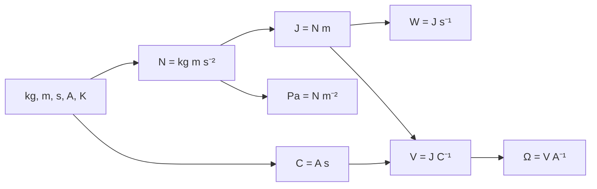

# 1.2 SI units
> [!abstract] In one breath
> Every unit you need in this topic is built from the five SI base units listed in the syllabus: kg, m, s, A and K. A derived unit is just a product or quotient of those, so writing a unit in base units lets you check an equation for homogeneity, and prefixes scale any unit by a power of ten.

## Key ideas
**Base quantities and units.** mass, kilogram (kg); length, metre (m); time, second (s); current, ampere (A); temperature, kelvin (K). A *quantity* is what is measured; a *unit* is what it is measured in. Time is a quantity, the second is its unit. The base unit of mass is the **kilogram**, not the gram.

**Derived units** are products or quotients of base units:

| Unit | From | In base units |
| --- | --- | --- |
| newton, N | $F=ma$ | $\mathrm{kg\,m\,s^{-2}}$ |
| joule, J | $W=Fs$ | $\mathrm{kg\,m^{2}\,s^{-2}}$ |
| watt, W | $\mathrm{J\,s^{-1}}$ | $\mathrm{kg\,m^{2}\,s^{-3}}$ |
| pascal, Pa | $\mathrm{N\,m^{-2}}$ | $\mathrm{kg\,m^{-1}\,s^{-2}}$ |
| coulomb, C | current $\times$ time | $\mathrm{A\,s}$ |
| volt, V | $\mathrm{J\,C^{-1}}$ | $\mathrm{kg\,m^{2}\,s^{-3}\,A^{-1}}$ |
| ohm, Ω | $\mathrm{V\,A^{-1}}$ | $\mathrm{kg\,m^{2}\,s^{-3}\,A^{-2}}$ |

**Homogeneous equation**: every term on both sides has the same SI base units. Pure numbers such as $\tfrac12$, $2\pi$ and $4\pi^2$ have no units.

**Prefixes** (base *or* derived units):

| p | n | μ | m | c | d | k | M | G | T |
| --- | --- | --- | --- | --- | --- | --- | --- | --- | --- |
| $10^{-12}$ | $10^{-9}$ | $10^{-6}$ | $10^{-3}$ | $10^{-2}$ | $10^{-1}$ | $10^{3}$ | $10^{6}$ | $10^{9}$ | $10^{12}$ |

## Method
1. **Base units of a derived quantity:** write its defining equation, replace each quantity by its unit, replace derived units by base units, then add powers when multiplying and subtract when dividing.
2. **Checking homogeneity:** find the base units of every term on each side. Terms that are added or subtracted must match each other and the other side. Numbers have no units.
3. **Finding unknown powers:** write $x=C\,a^{p}b^{q}$, put base units on both sides, then equate the power of each base unit and solve.
4. **Converting prefixes:** replace the prefix by its power of ten. For a squared or cubed unit, the power applies to the prefix too. Convert grams to kilograms before substituting.

> [!example]- Worked example
> Find $a$ and $b$ in $v=Cp^{a}\rho^{b}$ for the speed of sound in a gas, where $C$ has no units, the pressure $p$ is $\mathrm{kg\,m^{-1}\,s^{-2}}$ and the density $\rho$ is $\mathrm{kg\,m^{-3}}$.
> The base units of $p^{a}\rho^{b}$ are $\mathrm{kg^{a+b}\,m^{-a-3b}\,s^{-2a}}$ and $v$ is $\mathrm{m\,s^{-1}}$.
> Powers of s: $-2a=-1$, so $a=0.5$.
> Powers of kg: $a+b=0$, so $b=-0.5$.
> Check powers of m: $-a-3b=-0.5+1.5=1$. ✓
> $$v=C\sqrt{\frac{p}{\rho}}$$

## Traps
- **Trap:** "The gram is the base unit of mass." **Why it's wrong:** the base unit is the kilogram. **Instead:** convert grams to kilograms first.
- **Trap:** giving a unit when the question asks for a quantity (second instead of time). **Why it's wrong:** a quantity is what is measured; a unit is what it is measured in. **Instead:** ask "what is being measured?"
- **Trap:** pairing a quantity with the wrong unit (ampere for charge). **Why it's wrong:** the ampere is the unit of current; charge is derived, its unit is the coulomb, $\mathrm{A\,s}$. **Instead:** check that the unit measures that quantity.
- **Trap:** dropping or mis-signing a power, such as watt $=\mathrm{kg\,m^2\,s^{-1}}$. **Why it's wrong:** $\mathrm{J\,s^{-1}}$ has the $\mathrm{s^{-2}}$ from the joule and another $\mathrm{s^{-1}}$. **Instead:** substitute step by step and list every base unit.
- **Trap:** "It is homogeneous, so it is correct." **Why it's wrong:** factors like $\tfrac12$ or $2\pi$ have no units. **Instead:** treat homogeneity as necessary, not sufficient.
- **Trap:** $1\ \mathrm{mm^2}=10^{-3}\ \mathrm{m^2}$, or GΩ as $10^{6}$ and pA as $10^{-9}$. **Why it's wrong:** the prefix is squared with the unit. **Instead:** write $(10^{-3}\ \mathrm{m})^2=10^{-6}\ \mathrm{m^2}$; giga is $10^{9}$, pico is $10^{-12}$.

## Exam technique
- *State* or *Give*: recall the answer with no working, giving the correct unit, in base units when the question asks for base units. *Show that*: every substitution step must be visible, ending with the required result.
- Give base-unit answers in a tidy form, for example $\mathrm{kg\,m^{2}\,s^{-3}\,A^{-1}}$, with negative powers rather than a mix of "per".
- Define quantities using other quantities ("per unit time"), not units ("per second"); examiners penalise this.
- Convert every prefixed value at the start (g to kg, mm to m) and quote the final answer to the sig. figs asked for.
- In "show that an equation is homogeneous", write the base units of each term separately, then state that both sides match.

## Links
Builds on [[1.1 Physical quantities]] · Leads to [[1.3 Errors and uncertainties]] and [[2.1 Equations of motion]]
