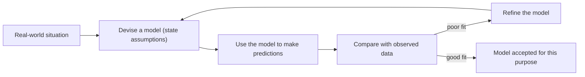

# 1 Mathematical models in probability and statistics

> [!abstract] In one breath
> A statistical model is a simplified, assumption-based mathematical description of a real situation, used to describe it and predict what will happen. You build it, use it, compare its predictions with real data, and refine it if the fit is poor.

## Key ideas

**Statistical model**: a simplified mathematical description of a real-world situation, using assumptions, used to describe it and to make predictions. Simplifying is the point: a model that included every detail would be no easier to use than reality.

**Population**: the whole set of items or individuals of interest. **Sample**: a selection of items taken from the population, used to find out about it. A value found from a sample only estimates the population value, and it changes from sample to sample.

**Random variable**: a variable whose numerical value depends on the outcome of a chance event. A capital letter names it and a lower-case letter is one particular value: $X$ is the score on a fair die, and $x=4$ is one value it can take. For a fair die

$$P(X=x)=\frac16,\qquad x=1,2,\dots,6.$$

**Assumptions**: simplifying statements taken to be true so the model can be built, such as "the die is fair (each score is equally likely)" and "the throws are independent (one throw does not affect the next)". Predictions are only as reliable as the assumptions.

**Prediction versus observation**: a model gives a predicted value, but real data vary by chance around it. For 60 throws of a fair die the model predicts $60\times\tfrac16=10$ sixes. Getting 7 or 13 is ordinary variation, whereas 25 sixes is a large gap that suggests the die is not fair. Over very many trials the relative frequency settles near the model probability.

**Advantages**: a model simplifies a complex situation, is quicker and cheaper than experimenting, and allows predictions. **Limitations**: it is a simplification, so its results are only as good as its assumptions.

## Method

1. Identify the real situation and the quantity of interest, and name the random variable.
2. State the assumptions in context.
3. Use the model to calculate a prediction, such as a probability or an expected count.
4. Compare the prediction with observed data: small differences are chance, large systematic ones suggest the model is unsuitable.
5. Refine: change an assumption or the probabilities, then test again.

> [!example]- Worked example
> A student throws a die 120 times: scores $1$ to $6$ occur $22,17,19,20,24,18$ times. The model says each score is equally likely. Comment on the model.
>
> 1. Find the predicted frequency for each score:
> $$120\times\tfrac16=20$$
>    *(Each score has probability $\tfrac16$ under the model, so multiply by the number of throws.)*
> 2. Find the differences from 20: $2,3,1,0,4,2$. The largest is $4$, for the score 5.
>    *(Compare every observed value with the prediction, not just the highest one.)*
> 3. Conclude in context: no score differs systematically or by a large amount, and the differences lie both above and below 20, which is consistent with chance variation, so the fair-die model is suitable and there is no evidence to reject it.
>    *(A comment needs a reason from the numbers and a conclusion about the model, not just "close".)*

## Traps

- **Trap:** Saying the model is wrong because the observed count is not exactly the predicted count. **Why it's wrong:** real data vary by chance about the prediction. **Instead:** judge whether the difference is small or large compared with the prediction.
- **Trap:** Thinking a six is "due" after a run without one. **Why it's wrong:** throws are assumed independent, so the probability stays $\tfrac16$. **Instead:** treat every throw as a fresh trial.
- **Trap:** Calling the sample the population. **Why it's wrong:** the population is the whole set of interest and the sample is only a selection from it. **Instead:** ask who the question is about, then who was actually measured.
- **Trap:** Treating $X$ as an unknown to solve for. **Why it's wrong:** $X$ is a variable that takes different values by chance. **Instead:** write $X$ for the variable and $x$ for a particular value.
- **Trap:** Treating assumptions as proven facts. **Why it's wrong:** they are simplifications that may be only approximately true. **Instead:** state them and test them against data.

## Exam technique

- *State* an assumption in context ("the die is fair", "the tosses are independent") rather than saying "the model is random".
- *Comment* or *Explain* on suitability needs a reason using the numbers, then a conclusion about the model.
- A refinement must say what to change in the model, such as using observed relative frequencies as the probabilities. On its own, collecting more data does not refine the model.
- Avoid "the model is perfect" or "the model is useless": a model is judged by how well it fits, not by being exact.
- Use the wording of the question (die, coin, tenants) in every answer, not a general phrase.

## Links
Leads to [[2 Representation and summary of data]]
